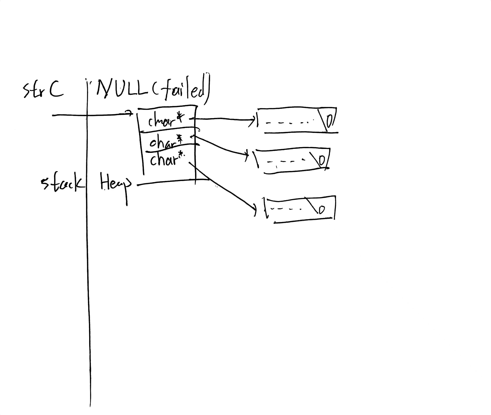

# 思考题
1. - strA:15*NUM,300
   - strB:指针数组15 × sizeof(char*),120(本机环境为amd64架构)
   - strC与strD：单个指针，sizeof(char*)，8(本机环境为amd64架构)
   验证： 添加`printf("sizeof(strA)=%zu, sizeof(strB)=%zu, sizeof(strC)=%zu, sizeof(strD)=%zu\n", sizeof(strA), sizeof(strB), sizeof(strC), sizeof(strD));`
    ```
    linull@linull  ~/Documents/storage/Currently/SHUSum01/Sorts/Debug   main  ./sorts 
    sizeof(strA)=300, sizeof(strB)=120, sizeof(strC)=8, sizeof(strD)=8
           *** 多种不同存储方式的C-字符串数组的排序 ***

    ....
    ```
    - StrA: 常量 Read only
    - StrB: 栈上，Read/Write
    - StrC/StrD： 堆上Read/Write


## 文中思考题
1. 思考题：为什么需要进行强制转换成unsigned char*：  
   - 因为需要考虑到非 ASCII 字符，比如汉字字符的支持。（注：此小组项目文件我已经转为了UTF-8编码）
   - Undefined behavior:C 标准中，char 可以是 signed char 或 unsigned char，具体由编译器决定。
   - C的`String.h`中的行为亦是如此
2. 思考题：有哪些情况使本循环结束   
   `*p1 && *p2 && *p1++==*p2++` p1和p2尚未结束。（‘\0’为false;同时保证字典序的正确。
3. 思考题：GetStringsA1本函数与上面的GetStringSA函数的功能是否相同？调用本函数时，应该用何种表达式？   
   GetStringsA的行为：使用三级指针 char ***dest，直接修改调用方的 strC（二级指针）   
   GetStringsA1：返回堆分配的 char**
4. 思考题： FreeStrings1本函数能否完成释放堆内存资源的任务？有何缺陷？  
   可以完成任务。缺陷是没有设置strs为NULL
5. GetStringsA(&strC, strA, n1);如果换成 GetStringsA1 函数，则调用语句应该是怎样的？  
   StrC=GetStringsA(strA, n1);
6. 请画出strC或strD的结构图

7. `BubbleB(strC, n1);`此处能否调用BubbleA函数对strC进行排序？如果要用BubbleA函数，需要对GetStringsA函数进行怎样的修改？（由于strC与StrD相似，StrD省略）   
   BubbleA(&strC, n1)
8. FreeStrings(&strC, n1);如果调用 FreeStrings1 函数，则应该执行哪些语句？
   ```C
   FreeStrings1(strC, n1);
   strC=NULL;
   ```